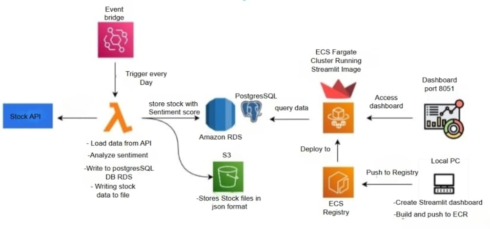

# stocksentimentanalysis
📊 Stock Sentiment Analysis Dashboard

This project implements a serverless, cloud-native pipeline to analyze stock sentiment and visualize it using a Streamlit dashboard deployed via AWS ECS Fargate. The data is collected daily from a stock API, analyzed for sentiment, and stored in Amazon RDS and S3. A Streamlit dashboard allows users to visualize and explore the sentiment trends.

EventBridge (Daily Trigger)
       ⬇️
AWS Lambda:
  - Fetch stock data from API
  - Analyze sentiment
  - Store in PostgreSQL (Amazon RDS)
  - Save stock data as JSON in S3
       ⬇️
Streamlit Dashboard:
  - Created locally
  - Built into a Docker image
  - Pushed to Amazon ECR
       ⬇️
Deployed on:
  - ECS Fargate Cluster
  - Queries RDS for data
  - Runs Streamlit app on port 8051

    Architecure Diagram

    
 

🛠️ Technologies Used

  - AWS Lambda

  - AWS EventBridge

  - Amazon RDS (PostgreSQL)

  - Amazon S3

  - Amazon ECS & Fargate

  - Amazon ECR

  - Streamlit

  - Python

  - Docker
    
